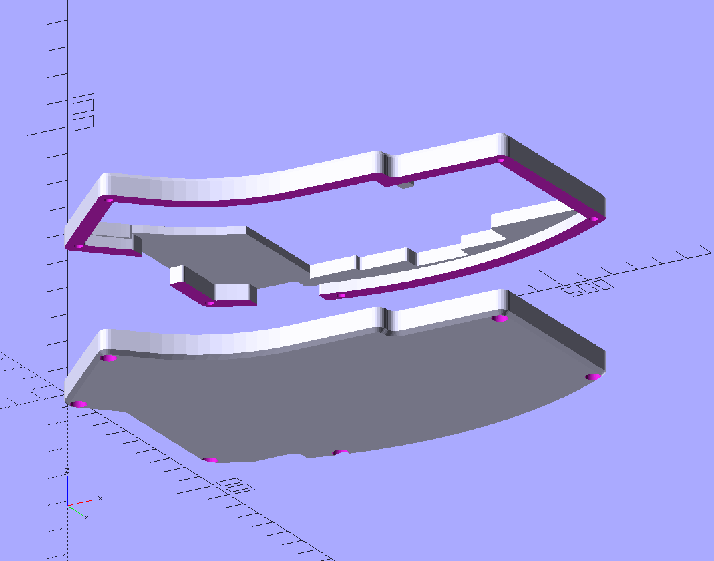
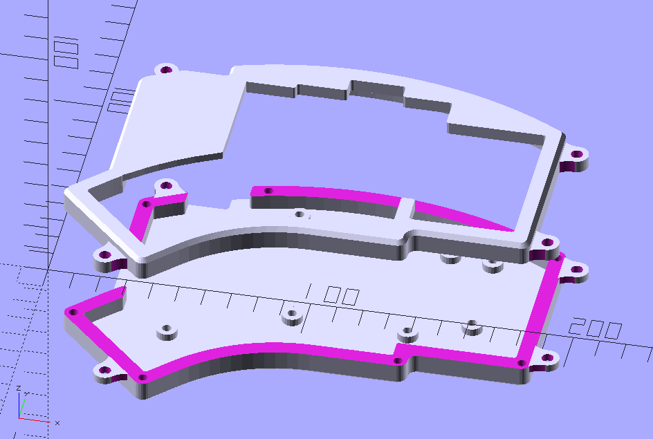

# EC Kyria_Case V1.3
A case meant to be 3d printed.
This version is usable. I'll admit that certain things can be improved but personally after printing this version I am happy.

This assembly has been tested with a 2mm plate (although I guess plateless will work as well but there will be some gap between the top part of the case and the pcb.

I plan to test it with 3mm plate in the near future.

* I am using M2 3mm heat inserts for both the bottom of the case as well as for the top of the case. 
* I tighten the two parts together by using a 2M screws and nuts.
* the pcb is screwed to the bottom half with flat screws

# EC Kyria_Case V1.4 
This is an improved version of the case by [G-Radiation](https://github.com/G-Radiation)
It uses M4 screws for tenting, you will need to use the corresponding nuts. 

